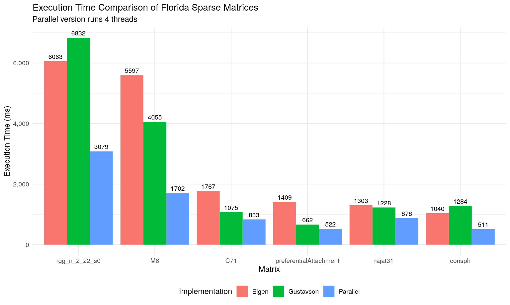

# Gustavson SpGEMM
This repository contains two optimized implementations of the Gustavson Sparse Matrix Multiplication algorithm - one sequential and the other parallel via OpenMP.

This was my final project for the course "Efficient Parallel C++" at Karlsruhe Institute of Technology.
The goal of this project was to implement the Gustavson algorithm and optimize the performance of both the sequential and parallel version.

<figure>
  
  <figcaption>
    Comparison of execution times: <a href="https://eigen.tuxfamily.org">Eigen Library's</a> sequential SpGEMM vs. my sequential and parallel SpGEMM.
  </figcaption>
</figure>

## Getting started
### Pre-requisites
1. **CMake:** Version 3.22 or higher
2. **C++ Compiler:** C++20 or higher
3. (Optional) Maybe some other system libraries to run tsan, msan and ubsan

### Building
1. Clone the repository
    ```sh
    git clone https://github.com/BraSDon/SpGEMM.git
    ```
2. Change into the project directory
    ```sh
    cd SpGEMM/
    ```
3. Initialize submodules
    ```sh
    git submodule update --init --recursive
    ```
4. Initialize the build directory
    ```sh
    cd implementation/
    cmake --preset release
    ```
5. Build the project
   ```sh
    cmake --build --preset release
    ```

### Testing
```sh
cd build-release/
ctest
```

### Benchmarking
1. Download the matrices
    ```sh
    cd implementation/
    mkdir data/
    sh ./download_matrices.sh
    ```
2. Run the benchmarks
   ```sh
    cd build-release/benchmark/
    ./bench
    ```
   or if you want **plots**
    ```sh
    cmake --build --preset release -t plots
    ```

## Benchmarking
You can find the benchmarking results in the `documentation/plots.pdf` file. They were run on a desktop PC with the following specifications:
- CPU: Intel Core i7-7700K (4 cores, 8 threads)
- RAM: 16 GB DDR4 @ 2400 MT/s

### Matrices
In addition to randomly generated matrices, the following matrices from the [Florida Sparse Matrices](http://sparse.tamu.edu/) were used for benchmarking:

| Name                      | Dimensions       |    Nnz    | Density (%) | Nnz in result | Symmetric | Binary |
|---------------------------|------------------|-----------|-------------|---------------|-----------|--------|
| nemeth07                  | 9.5K x 9.5K      |   394.8K |    0.4375   |      892.1K   |   true    | false  |
| lhr71c                    | 70.3K x 70.3K    |   1,528K |    0.0309   |        8.2M   |   true    | false  |
| c-71                      | 76.6K x 76.6K    |   859.5K |    0.0146   |       52.5M   |   true    | false  |
| preferentialAttachment    | 100K x 100K      |   999.9K |    0.0100   |       32.9M   |   true    |  true  |
| consph                    | 83.3K x 83.3K    |       6M |    0.0865   |       26.5M   |   true    | false  |
| rgg_n_2_22_s0             | 4.1M x 4.1M      |    60.7M |    0.0004   |      187M     |   true    |  true  |
| ASIC_680ks                | 682.7K x 682.7K  |     1.6M |    0.0003   |       15.9M   |  false    | false  |
| rajat31                   | 4.6M x 4.6M      |    20.3M |    0.0001   |       53.1M   |  false    | false  |
| M6                        | 3.5M x 3.5M      |      21M |    0.0002   |       53.1M   |   true    |  true  |
